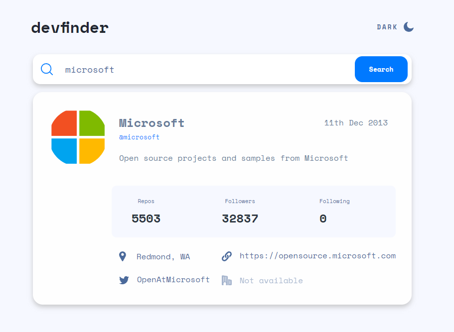

# Frontend Mentor - user-search-app solution

This is a solution to the [GitHub user search app on Frontend Mentor](https://www.frontendmentor.io/challenges/github-user-search-app-Q09YOgaH6). Frontend Mentor challenges help you improve your coding skills by building realistic projects. 

## Overview
This is the Second site I have made using an API. It was quite challenging to figure out some of the logic. I feel that the code may be a bit bloated 
in some areas, particulary with the CSS as this was also the first time I attempted to create a light dark theme switcher without
looking up how it is done online. Overall I feel that it was a good challenge and a good introduction into APIS and how they work.

### The challenge

Users should be able to:

- View the optimal layout for the app depending on their device's screen size
- See hover states for all interactive elements on the page (only works for icon)
- Search for GitHub users by their username
- See relevant user information based on their search
- Switch between light and dark themes

### Screenshot

### Links

- [Live site](https://bengera.github.io/user-search-app/)

## My process

### Built with

- Semantic HTML5 markup
- SCSS/CSS
- Flexbox
- CSS Grid
- Vanilla JavaScript
- Mobile-first workflow

### Areas for improvement / If I did this project again.

- Taking more time to see which HTML stucture would be best, based on how the layout was going to change from mobile to desktop.
- Finding a more effecient way of switching light/dark themes without having to edit each element seperately.

